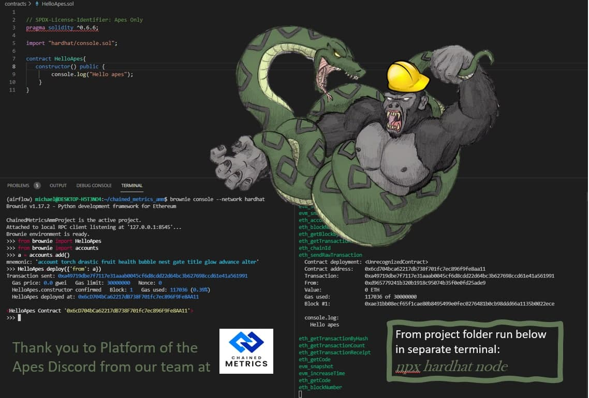
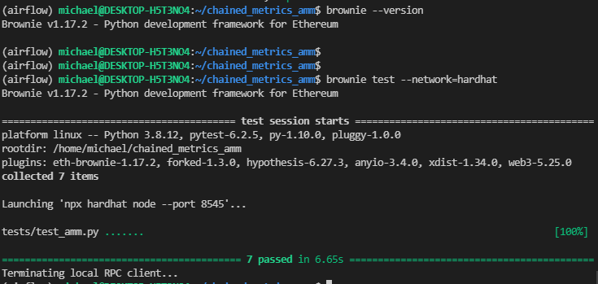

## ChainedMetrics AMM

This repo contains the Chained Metrics AMM for providing liquidty and entering in Buy and Sell orders against the AMM. The contract is structured as follows:

### Directory Structure
The project structure was created using `brownie init` to create the default structure

    .
    ├── contracts             # All Solidity smart contracts
    ├── tests                 # The pytests for the smart contracts
    ├── build                 # Build artifacts from compiling smart contracts
    ├── assets                # Images mainly just for README
    └── scripts               # Deployment scripts
    └── hardhat               # Folder we created that contains console.log sol file
    └── packages              # Reusable python packages for testing/deployment/analytics
    └── hardhat.config.js     # Autogenerated from brownie. Not changed
    └── brownie-config.yaml   # Default brownie network and config file
    └── README.md

We are currently using Brownie v1.17.2 along side hardardhat. The below infographic explains how to run Brownie with Hard hat from this folder.

.

### Tests
Once you clone the repo and install brownie with 1.17.2 you can run tests from the root directory with:

`brownie test`

OR if you want to run tests with hardhat:

1. From first terminal run `npx hardhat node` from root directory
2. From root directory run `brownie test --network=hardhat`

## Overview of Contracts
* FixdedProductMarketMaker.sol
    * Primary Contract of the repo that determinse the buy, sell, funding amount
    * Mints the Long and Short contracts within the constructor
    * Owns the collateralized liquidity and Long/Short liquidity pool
    * Inhereits from ERC20 so that it can provide liquidity tokens
    * INhereits from EIP712 contracts to enable gassless
* ScalarToken.sol
    * The contracts for the Long and Short tokens
    * Usese AccessControl to allow the owner to mint and burn
    * Owner should be the AMM that creates the tokens in the constructor
    * Inhereits from EIP712 to enable gassless
* Math.sol
    * Taken from Uniswap V2 to implement an square root function
* EIP712Base.sol & EIP712MetaTransaction.sol
    * Coppied from [Biconomy's github](https://github.com/bcnmy/metatx-standard/blob/master/src/contracts/EIP712MetaTransaction.solf)
    * Enable Gassless transactions
* hardhat/console.sol
    * The hardhat console.sol file taken from hard hat used for debugging